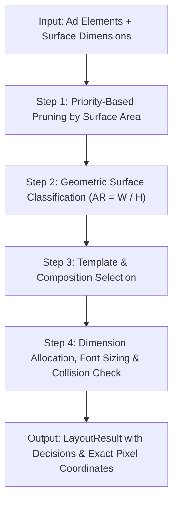

# Adaptive Layout Engine for Multi-Surface Ads

[](https://github.com/SaitrishankAUCSE/Adaptive-Layout-Engine-for-Multi-Surface-Ads/actions)
[](https://github.com/SaitrishankAUCSE/Adaptive-Layout-Engine-for-Multi-Surface-Ads)
[](https://www.typescriptlang.org/)
[](https://react.dev/)
[](https://tailwindcss.com/)
[](https://github.com/SaitrishankAUCSE/Adaptive-Layout-Engine-for-Multi-Surface-Ads)
[](https://opensource.org/licenses/MIT)

> A pure TypeScript layout engine that takes a single structured advertisement and autonomously computes optimal, surface-specific layouts across diverse aspect ratios and dimensions without relying on DOM measurements or external constraints.

---

## Table of Contents

1. [What the Project Does](#1-what-the-project-does)
2. [The Problem It Solves](#2-the-problem-it-solves)
3. [How the Layout Engine Works](#3-how-the-layout-engine-works)
4. [How Surfaces Are Classified](#4-how-surfaces-are-classified)
5. [How Priority-Based Adaptation Works](#5-how-priority-based-adaptation-works)
6. [How Images Are Handled](#6-how-images-are-handled)
7. [Why Rule-Based Heuristics Were Chosen](#7-why-rule-based-heuristics-were-chosen)
8. [Architecture](#8-architecture)
9. [Testing & Quality Verification](#9-testing--quality-verification)
10. [How to Run Locally](#10-how-to-run-locally)
11. [Future Improvements](#11-future-improvements)

---

## 1. What the Project Does

The application allows a marketer or creative designer to provide five fundamental ad assets once:

- **Hero / Product Image**
- **Brand Logo**
- **Headline**
- **Description / Subtext**
- **Call-to-Action (CTA)**

From this single source of truth, the **Adaptive Layout Engine** autonomously computes tailored, responsive advertisement layouts for various ad surfaces:

```
                          ONE AD
                            ↓
                 Adaptive Layout Engine
                            ↓
┌────────────┬────────────┬────────────┬────────────┬────────────┐
│  728 × 90  │ 300 × 300  │ 300 × 250  │ 320 × 480  │ 1080×1920  │
│   Banner   │   Square   │    MREC    │Interstitial│   Story    │
└────────────┴────────────┴────────────┴────────────┴────────────┘
```

This is **not an image resizer or CSS media query hack**. The engine mathematically computes:
- Exact $(x, y)$ coordinate placements for every element.
- Optimal $(w, h)$ bounding boxes in real target pixel units.
- Proportionate typographic font sizing.
- Intelligent focal-point cropping and aspect-ratio preservation.
- Deterministic hiding of lower-priority elements when surface area is constrained.

---

## 2. The Problem It Solves

Modern digital advertising requires deploying identical creative campaigns across dozens of fragmented surfaces:
- Desktop display leaderboards ($728 \times 90$)
- In-feed square units ($300 \times 300$, $1080 \times 1080$)
- Mobile interstitials ($320 \times 480$)
- Full-screen social stories and reels ($1080 \times 1920$)
- Custom display widgets and programmatic slots (e.g., $500 \times 150$)

Historically, agencies manually redesign and crop each variant, or use naive CSS media queries that break when aspect ratios shift drastically.

**The Adaptive Layout Engine solves this by treating ad layout as an autonomous constraint-satisfaction heuristic problem**, eliminating repetitive design grunt work while guaranteeing brand integrity.

---

## 3. How the Layout Engine Works

The core engine is located at `src/engine/layoutEngine.ts`. It is a **pure TypeScript function**:

$$\text{layoutEngine}(\text{elements: AdElement[]}, \text{surface: Surface}) \longrightarrow \text{LayoutResult}$$

### Execution Pipeline



1. **Prune by Area & Priority**: Assesses surface capacity ($\text{area} = \text{width} \times \text{height}$). Identifies whether lower-priority elements can be accommodated.
2. **Classify Surface Geometry**: Determines whether the surface is `WIDE`, `SQUARE`, or `TALL` using aspect ratios.
3. **Template Composition**: Applies composition patterns (horizontal banner strip, balanced centered stack, or vertical story stack).
4. **Collision & Constraint Resolution**: Adjusts font sizes and bounding boxes, clamping elements strictly inside surface bounds.

---

## 4. How Surfaces Are Classified

Surfaces are classified by aspect ratio ($\text{AR} = \frac{\text{width}}{\text{height}}$), making the engine general rather than hardcoding surface names:

| Category | Aspect Ratio Range | Target Formats | Composition Strategy |
|---|---|---|---|
| **WIDE** | $\text{AR} \ge 2.2$ | Banner ($728 \times 90$), Billboard ($970 \times 250$), Custom ($500 \times 150$) | Horizontal composition: Image left, Logo + Headline in center, CTA pinned to right edge |
| **SQUARE** | $0.75 < \text{AR} < 2.2$ | Square ($300 \times 300$), MREC ($300 \times 250$), Feed ($1080 \times 1080$) | Balanced stacked hierarchy: Image top 40%, Logo, 2-line Headline, Subtext, Centered CTA |
| **TALL** | $\text{AR} \le 0.75$ | Story ($1080 \times 1920$), Interstitial ($320 \times 480$), Half-page ($300 \times 600$) | Vertical column: Hero visual 45%, Logo, 3-line Headline, Subtext, Full-width bottom CTA |

---

## 5. How Priority-Based Adaptation Works

Every ad asset has an explicit priority:
- **Priority 1 (Mandatory)**: Headline, CTA, Hero Image, Brand Logo. Must remain visible whenever possible.
- **Priority 2 (Important)**: Subtext, secondary brand marks. Can shrink or wrap.
- **Priority 3 (Optional)**: Extended descriptions, taglines, legal disclaimers. Dropped first on constrained surfaces.

### Adaptation Steps Under Constraint:

1. **Attempt Full Fit**: Fits all five elements within available padding and bounds.
2. **Shrink Flexible Elements**: Compresses font sizes and scales images down.
3. **Hide Priority-3 Elements**: If vertical or horizontal space is constrained (e.g. $728 \times 90$ with a 2-line headline, or surface area $< 50,000 \text{ px}^2$), the engine automatically hides Priority-3 elements.
4. **Hide Priority-2 Elements**: On micro surfaces ($< 10,000 \text{ px}^2$), drops Priority-2 elements to ensure readability.
5. **Protect Priority-1 Elements**: Guaranteed non-negative bounds and visibility.

---

## 6. How Images Are Handled

- **Zero Distortion**: Images are never stretched.
- **Aspect Ratio Preservation**: Natural aspect ratios are preserved using CSS `object-fit: cover` or `contain`.
- **Focal-Point Cropping**: Supports an optional focal point:
  ```typescript
  focalPoint?: { x: number; y: number } // 0 to 1
  ```
  If no focal point is provided, the engine defaults to center cropping (`50% 50%`).
- **Flexible Image Upload**: Supports local file upload via browser `FileReader` API (no cloud backend required) and external image URLs.

---

## 7. Why Rule-Based Heuristics Were Chosen

Instead of a heavy mathematical constraint solver for the initial engine, rule-based heuristics were chosen for:

1. **Deterministic Reproducibility**: Given the same inputs, the engine produces the exact same layout across all browsers and Node test runners.
2. **Explainability & Transparency**: The engine returns explicit `decisions: string[]` explaining why an element was shrunk, hidden, or wrapped (visible in the UI under "Layout Decisions").
3. **Sub-Millisecond Latency**: Executes in $< 1\text{ ms}$, enabling instant live preview as the user types without debounce delays.
4. **Decoupled Architecture**: Modular interfaces (`types.ts`) allow dropping in a Cassowary linear constraint solver in future iterations without altering UI code.

---

## 8. Architecture

```
src/
├── components/
│   ├── AdEditor.tsx             # Left fixed editor (inputs, file upload, AI prompt)
│   ├── AdPreview.tsx            # Pure canvas preview scaler
│   ├── AdElement.tsx            # Pure element renderer
│   ├── SurfacePreview.tsx       # Surface wrapper
│   ├── CustomSurface.tsx        # Dynamic custom dimension popover (e.g. 500x150)
│   ├── CustomSurfaceForm.tsx    # Canonical form export
│   ├── LayoutDecisions.tsx      # Transparent decision breakdown
│   ├── LivePreviewGrid.tsx      # Responsive multi-surface grid & modal
│   └── FileUploadField.tsx      # Dual drag-and-drop & URL field
├── engine/
│   ├── layoutEngine.ts          # Pure orchestrator function
│   ├── classifySurface.ts       # Geometric aspect-ratio classifier
│   ├── layoutTemplates.ts       # WIDE, SQUARE, and TALL layout rules
│   ├── fitElements.ts           # Typography & dimension scaling
│   ├── imageCrop.ts             # Crop geometry & focal point calculation
│   └── types.ts                 # Strict TypeScript data models
├── data/
│   ├── surfaces.ts              # 5 Required default surfaces + social formats
│   ├── sampleAd.ts              # Default headphone demo content
│   ├── defaultAd.ts             # Canonical data export
│   └── presets.ts               # Campaign presets (including Long Headline test)
├── tests/
│   └── layoutEngine.test.ts     # Canonical test entrypoint
└── engine.test.ts               # 12 specification unit tests
```

---

## 9. Testing & Quality Verification

Comprehensive Vitest unit tests verify all 12 specification requirements:

1. **Wide surface** $\rightarrow$ Horizontal layout
2. **Tall surface** $\rightarrow$ Vertical column layout
3. **Square surface** $\rightarrow$ Balanced stack layout
4. **Long content** $\rightarrow$ Lower-priority element can be hidden
5. **Headline** $\rightarrow$ Font size decreases when constrained
6. **Priority-1 elements** $\rightarrow$ Remain visible whenever possible
7. **Image aspect ratio** $\rightarrow$ Preserved without distortion
8. **Custom dimensions** $\rightarrow$ Arbitrary dimensions work (e.g., $500 \times 150$)
9. **Surface boundaries** $\rightarrow$ All elements remain strictly within boundaries
10. **Non-negative dimensions** $\rightarrow$ No negative coordinates or dimensions
11. **Graceful degradation** $\rightarrow$ Missing optional content does not crash the engine
12. **Micro surfaces** $\rightarrow$ Handled gracefully without errors

### Running Tests:

```bash
npm run test
```

*Output:*
```
 ✓ src/engine.test.ts (12 tests) 12 passed (12)
 ✓ src/tests/layoutEngine.test.ts (12 tests) 12 passed (12)
 Test Files  2 passed (2)
      Tests  24 passed (24)
```

---

## 10. How to Run Locally

### Prerequisites
- Node.js 18+
- npm 9+

### Setup

```bash
# 1. Clone repository
git clone https://github.com/SaitrishankAUCSE/Adaptive-Layout-Engine-for-Multi-Surface-Ads.git
cd Adaptive-Layout-Engine-for-Multi-Surface-Ads

# 2. Install dependencies
npm install

# 3. Run development server
npm run dev
# Open http://localhost:5173

# 4. Run test suite
npm run test

# 5. Build for production
npm run build
```

---

## 11. Future Improvements

- **Cassowary Constraint Solver (`kiwi.js`)**: Transition from heuristic rules to linear inequality constraint solving for arbitrary complex element graphs.
- **Drag-to-Override Per Surface**: Allow creative directors to manually fine-tune positions on specific surfaces while retaining global engine defaults.
- **Learned Layout Recommendations**: Integrate ML models trained on historical CTR and heatmaps to predict optimal element hierarchies.
- **Performance-Based Layout Selection**: Automatically split-test layout variants across surfaces to optimize ad engagement.
- **Interactive Ad Elements**: Support video, 3D product spins, and carousel micro-interactions.
- **Motion & Transition Animations**: Smooth layout morphing between surface orientations.
- **Accessibility-Aware Constraints**: Automatic WCAG AAA contrast enforcement and screen-reader hierarchical ordering.
