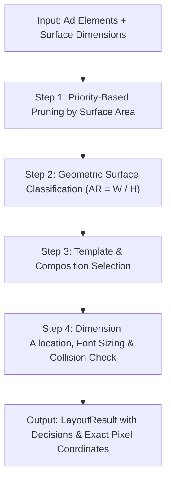

# Adaptive Layout Engine for Multi-Surface Ads

[](https://github.com/SaitrishankAUCSE/Adaptive-Layout-Engine-for-Multi-Surface-Ads/actions)
[](https://github.com/SaitrishankAUCSE/Adaptive-Layout-Engine-for-Multi-Surface-Ads)
[](https://www.typescriptlang.org/)
[](https://react.dev/)
[](https://tailwindcss.com/)
[](https://github.com/SaitrishankAUCSE/Adaptive-Layout-Engine-for-Multi-Surface-Ads)
[](https://opensource.org/licenses/MIT)

> A pure TypeScript layout engine that takes a single structured advertisement and autonomously computes optimal, surface-specific layouts across diverse aspect ratios and dimensions without relying on DOM measurements or external constraints.

**Live Production Deployment:** [https://anysize-ads.vercel.app](https://anysize-ads.vercel.app)

---

## Table of Contents

1. [Live Demo & Brand Identity](#1-live-demo--brand-identity)
2. [What the Project Does](#2-what-the-project-does)
3. [The Problem It Solves](#3-the-problem-it-solves)
4. [How the Layout Engine Works](#4-how-the-layout-engine-works)
5. [How Surfaces Are Classified](#5-how-surfaces-are-classified)
6. [How Priority-Based Adaptation Works](#6-how-priority-based-adaptation-works)
7. [How Images Are Handled](#7-how-images-are-handled)
8. [Why Rule-Based Heuristics Were Chosen](#8-why-rule-based-heuristics-were-chosen)
9. [AI-Assisted Copy Optimization ("✨ Enhance to Fit")](#9-ai-assisted-copy-optimization--enhance-to-fit)
10. [Architecture](#10-architecture)
11. [Testing & Quality Verification](#11-testing--quality-verification)
12. [How to Run Locally](#12-how-to-run-locally)
13. [Future Improvements](#13-future-improvements)

---

## 1. Live Demo & Brand Identity

- **Production App**: [https://anysize-ads.vercel.app](https://anysize-ads.vercel.app)
- **Visual Design Signature**: Dark obsidian canvas (`#08090c`) with luminous emerald neon (`#10b981`) and champagne cream (`#f0f1c7`) accents.
- **Brand Emblem**: Adaptive 3-Surface Geometry representing the three core ad formats — Top Wide Banner, Bottom Square, and Right Tall Story.
- **Multi-Platform Icon Suite**:
  - `favicon.ico`: Multi-resolution (16x16, 32x32, 48x48)
  - `favicon.svg`: Scalable glowing vector
  - `og-image-square.jpg`: Full-bleed dark square optimized for WhatsApp and instant messaging previews (zero white margins, zero blurry micro-text)
  - `og-image.jpg`: 1200×630 OpenGraph card for Twitter/X, LinkedIn, and Facebook


---

## 1. What the Project Does

The application allows a marketer or creative designer to provide five fundamental ad assets once:

- **Hero / Product Image**
- **Brand Logo**
- **Headline**
- **Description / Subtext**
- **Call-to-Action (CTA)**

From this single source of truth, the **Adaptive Layout Engine** autonomously computes tailored, responsive advertisement layouts for 13 distinct industry-standard formats:

```
                          ONE AD ASSET SET
                                 ↓
                      Adaptive Layout Engine
                                 ↓
┌────────────┬────────────┬────────────┬────────────┬────────────┐
│  728 × 90  │ 300 × 300  │ 300 × 250  │ 320 × 480  │ 1080×1920  │
│   Banner   │   Square   │    MREC    │Interstitial│   Story    │
├────────────┼────────────┼────────────┼────────────┼────────────┤
│ 970 × 250  │ 300 × 600  │ 1080×1080  │ 1080×566   │ 1200×675   │
│ Billboard  │ Half Page  │  IG Feed   │IG Landscape│   X Post   │
├────────────┼────────────┼────────────┴────────────┴────────────┘
│ 1128 × 191 │ 1200 × 630 │ 1280 × 720
│  LinkedIn  │ Open Graph │ YT Thumbnail
└────────────┴────────────┴─────────────
```

This is **not an image resizer or CSS media query hack**. The engine mathematically computes:
- Exact $(x, y)$ coordinate placements for every element.
- Optimal $(w, h)$ bounding boxes in real target pixel units.
- Proportionate typographic font sizing.
- Intelligent focal-point cropping and aspect-ratio preservation.
- Deterministic hiding of lower-priority elements when surface area is constrained.
- **Multi-Format Export Engine**: One-click download of all 13 layouts or customized selections as a unified ZIP archive containing 1:1 pixel PNGs, standalone IAB-compliant HTML5 banners, and the layout JSON manifest.
- **Enterprise AdTech Workspace**: Professional views including **Creative Studio**, **Placement Matrix**, and **Comparison Lab**.

---

## 2. The Problem It Solves

Modern digital advertising requires deploying identical creative campaigns across dozens of fragmented surfaces:
- Desktop display leaderboards ($728 \times 90$)
- In-feed square units ($300 \times 300$, $1080 \times 1080$)
- Mobile interstitials ($320 \times 480$)
- Full-screen social stories and reels ($1080 \times 1920$)
- Custom display widgets and programmatic slots (e.g., $500 \times 150$)

Historically, agencies manually redesign and crop each variant, or use naive CSS media queries that break when aspect ratios shift drastically.

**The Adaptive Layout Engine solves this by treating ad layout as an autonomous constraint-satisfaction heuristic problem**, eliminating repetitive design grunt work while guaranteeing brand integrity.

---

## 3. How the Layout Engine Works

The core engine is located at `src/engine/layoutEngine.ts`. It is a **pure TypeScript function**:

$$\text{layoutEngine}(\text{elements: AdElement[]}, \text{surface: Surface}) \longrightarrow \text{LayoutResult}$$

### Execution Pipeline



1. **Prune by Area & Priority**: Assesses surface capacity ($\text{area} = \text{width} \times \text{height}$). Identifies whether lower-priority elements can be accommodated.
2. **Classify Surface Geometry**: Determines whether the surface is `WIDE`, `SQUARE`, or `TALL` using aspect ratios.
3. **Template Composition & Scoring**: Evaluates layout templates against the surface and calculates a fitness score for each. The engine rewards high surface area utilization while heavily penalizing hidden or shrunk elements. The highest-scoring layout is selected dynamically.
4. **Canvas-Based Typography & Collision Resolution**: Utilizes the DOM Canvas API (`measureText`) to compute exact pixel widths of strings, ensuring 100% accurate line wrapping and bounding box constraints before clamping elements inside surface bounds.

---

## 4. How Surfaces Are Classified

Surfaces are classified by aspect ratio ($\text{AR} = \frac{\text{width}}{\text{height}}$), making the engine general rather than hardcoding surface names:

| Category | Aspect Ratio Range | Target Formats | Composition Strategy |
|---|---|---|---|
| **WIDE** | $\text{AR} \ge 2.2$ | Banner ($728 \times 90$), Billboard ($970 \times 250$), LinkedIn ($1128 \times 191$) | Horizontal composition: Image left, Logo + Headline in center, CTA pinned to right edge |
| **SQUARE** | $0.75 < \text{AR} < 2.2$ | Square ($300 \times 300$), MREC ($300 \times 250$), Feed ($1080 \times 1080$), X / Twitter ($1200 \times 675$) | Balanced stacked hierarchy: Image top 40%, Logo, 2-line Headline, Subtext, Centered CTA |
| **TALL** | $\text{AR} \le 0.75$ | Story ($1080 \times 1920$), Interstitial ($320 \times 480$), Half-page ($300 \times 600$) | Vertical column: Hero visual 45%, Logo, 3-line Headline, Subtext, Full-width bottom CTA |

---

## 5. How Priority-Based Adaptation Works

Every ad asset has an explicit priority:
- **Priority 1 (Mandatory)**: Headline, CTA, Hero Image, Brand Logo. Must remain visible whenever possible.
- **Priority 2 (Important)**: Subtext, secondary brand marks. Can shrink or wrap.
- **Priority 3 (Optional)**: Extended descriptions, taglines, legal disclaimers. Dropped first on constrained surfaces.

### Adaptation Steps Under Constraint:

1. **Attempt Full Fit**: Fits all five elements within available padding and bounds.
2. **Shrink Flexible Elements**: Compresses font sizes and scales images down.
3. **Hide Priority-3 Elements**: If vertical or horizontal space is constrained, the engine automatically hides Priority-3 elements.
4. **Hide Priority-2 Elements**: On micro surfaces ($< 10,000 \text{ px}^2$), drops Priority-2 elements to ensure readability.
5. **Protect Priority-1 Elements**: Guaranteed non-negative bounds and visibility.

---

## 6. How Images Are Handled

- **Zero Distortion**: Images are never stretched.
- **Aspect Ratio Preservation**: Natural aspect ratios are preserved using CSS `object-fit: cover` or `contain`.
- **Focal-Point Cropping**: Supports an optional focal point:
  ```typescript
  focalPoint?: { x: number; y: number } // 0 to 1
  ```
  If no focal point is provided, the engine defaults to center cropping (`50% 50%`).
- **Flexible Image Upload**: Supports local file upload via browser `FileReader` API (no cloud backend required) and external image URLs.

---

## 7. Why Rule-Based Heuristics Were Chosen

Instead of a heavy mathematical constraint solver for the initial engine, rule-based heuristics paired with dynamic scoring were chosen for:

1. **Deterministic Reproducibility**: Given the same inputs, the engine produces the exact same layout across all browsers and Node test runners.
2. **Explainability & Transparency**: The engine returns explicit `decisions: string[]` explaining exactly *why* a template won the scoring phase, or why an element was shrunk, hidden, or wrapped (visible in the UI under "Layout AST").
3. **O(1) Memoized Performance**: A built-in caching layer hashes the input elements and surface dimensions, allowing the engine to instantly return ASTs for unchanged surfaces. This guarantees buttery smooth 120fps UI updates even with dozens of surfaces rendering simultaneously.
4. **Decoupled Architecture**: Modular interfaces (`types.ts`) allow dropping in a Cassowary linear constraint solver in future iterations without altering UI code.

---

## 8. AI-Assisted Copy Optimization ("✨ Enhance to Fit")

When marketing copy is excessively long, tight ad surfaces (such as mobile banners or display leaderboards) inevitably experience text overflow or are forced to hide lower-priority content.

Instead of naive text truncation, Anysize features an **autonomous copy optimization engine**:

```
                       User Ad Copy
                            ↓
               Surface Pre-Evaluation (13/13)
        [If any surface has overflow / hidden content]
                            ↓
               ✨ AI Enhance to Fit Banner
                            ↓
         LLM / Deterministic Optimizer Proposal
                            ↓
     Strict Candidate Validation (All 13 Surfaces)
     ├── Zod Schema Verification
     ├── Zero Regressions on Valid Surfaces
     ├── Priority-1 Visibility Guaranteed
     └── Strict Score Improvement Required
             ↙                              ↘
   [Validation Passed]             [Validation Failed]
   Apply Optimized Copy            Rollback to Original
```

### Key Architectural Guarantees:
1. **Layout Engine is Source of Truth**: Success is measured exclusively by evaluating the candidate across all 13 surfaces using `evaluateAllSurfaces`. Character counts are never assumed to guarantee a fit.
2. **Zero Regressions & Automatic Rollback**: If a candidate causes a previously fitting surface to fail or hides a Priority-1 element, the proposal is rejected immediately and the original copy is preserved.
3. **Comparison Lab AI Word Enhancer Tool**: Positioned as a dedicated extra tool inside the **Comparison Lab**, the AI Word Enhancer allows copywriters to compare and transform long sentences in **Title (Headline)**, **Banner (Description)**, and **Alert Button (CTA)** into their shortest, highest-impact advertising forms with live character-reduction metrics (`before → after` diffs) and one-click batch condensation, keeping the Creative Studio clean and focused.
4. **Deterministic Mock Fallback**: In development or demo environments with no external API keys configured, a built-in deterministic optimizer (`src/engine/mockOptimizer.ts`) strips puffery, targets optimal character limits, and preserves CTA intent—passing through the exact same schema and layout validation pipeline.

---

## 9. Architecture

```
src/
├── components/
│   ├── AdEditor.tsx                 # Left fixed studio editor (inputs, file upload, AI generation)
│   ├── AdPreview.tsx                # Pure canvas preview scaler
│   ├── AdElement.tsx                # Pure element renderer
│   ├── AutoEnhanceBanner.tsx        # AI "Enhance to Fit" notification banner
│   ├── ComparisonAIWordEnhancer.tsx # Comparison Lab sentence condenser tool (Title, Banner, CTA)
│   ├── DownloadModal.tsx        # Multi-format ZIP export modal (HTML5, 1:1 PNG, JSON AST)
│   ├── SurfacePreview.tsx       # Surface wrapper
│   ├── CustomSurface.tsx        # Dynamic custom dimension popover (e.g. 500x150)
│   ├── CustomSurfaceForm.tsx    # Canonical form export
│   ├── LayoutDecisions.tsx      # Transparent decision breakdown
│   ├── LivePreviewGrid.tsx      # Responsive multi-surface grid & modal
│   └── FileUploadField.tsx      # Dual drag-and-drop & URL field
├── engine/
│   ├── layoutEngine.ts          # Pure orchestrator function
│   ├── classifySurface.ts       # Geometric aspect-ratio classifier
│   ├── layoutTemplates.ts       # WIDE, SQUARE, and TALL layout rules
│   ├── fitElements.ts           # Typography & dimension scaling
│   ├── imageCrop.ts             # Crop geometry & focal point calculation
│   ├── aiOptimizer.ts           # Multi-surface candidate validation & rollback logic
│   ├── mockOptimizer.ts         # Deterministic copy shortener for dev & demo
│   ├── useAIOptimizer.ts        # Reactive hook for layout analysis & optimization
│   └── types.ts                 # Strict TypeScript data models
├── lib/
│   ├── exportUtils.ts           # ZIP bundle generator, HTML5 banner compiler, Canvas 1:1 renderer
│   └── utils.ts                 # Tailwind merge utilities
├── data/
│   ├── surfaces.ts              # 13 Standard surfaces (IAB + Social formats)
│   ├── sampleAd.ts              # Default headphone demo content
│   ├── defaultAd.ts             # Canonical data export
│   └── presets.ts               # Campaign presets (including Long Headline test)
├── tests/
│   ├── layoutEngine.test.ts     # 13 Layout engine specification tests
│   └── aiOptimizer.test.ts      # 10 Validation & deterministic mock tests
├── engine.test.ts               # Complete engine specification suite (14 tests)
api/
└── generate-ad.ts               # Serverless endpoint (Gemini, OpenAI, Mock fallback)
```

---

## 10. Testing & Quality Verification

Comprehensive Vitest unit tests verify the layout engine specifications and AI optimization safety:

1. **Wide surface** $\rightarrow$ Horizontal layout
2. **Tall surface** $\rightarrow$ Vertical column layout
3. **Square surface** $\rightarrow$ Balanced stack layout
4. **Long content** $\rightarrow$ Lower-priority element can be hidden
5. **Headline** $\rightarrow$ Font size decreases when constrained
6. **Priority-1 elements** $\rightarrow$ Remain visible whenever possible
7. **Image aspect ratio** $\rightarrow$ Preserved without distortion
8. **Custom dimensions** $\rightarrow$ Arbitrary dimensions work (e.g., $500 \times 150$)
9. **Surface boundaries** $\rightarrow$ All elements remain strictly within boundaries
10. **Non-negative dimensions** $\rightarrow$ No negative coordinates or dimensions
11. **Graceful degradation** $\rightarrow$ Missing optional content does not crash the engine
12. **Micro surfaces** $\rightarrow$ Handled gracefully without errors
13. **Surface audit** $\rightarrow$ Verified across all 13 supported surfaces
14. **Deterministic mock optimization** $\rightarrow$ Verified deterministic shortening & filler stripping
15. **Strict candidate validation** $\rightarrow$ Confirmed acceptance only on genuine improvements and rejection on regressions

### Running Tests:

```bash
npm run test
```

*Output:*
```
 ✓ src/tests/aiOptimizer.test.ts (10 tests)
 ✓ src/engine.test.ts (14 tests)
 ✓ src/tests/layoutEngine.test.ts (13 tests)

 Test Files  3 passed (3)
      Tests  37 passed (37)
   Duration  1.34s
```

---

## 11. How to Run Locally

### Prerequisites
- Node.js 18+
- npm 9+

### Setup

```bash
# 1. Clone repository
git clone https://github.com/SaitrishankAUCSE/Adaptive-Layout-Engine-for-Multi-Surface-Ads.git
cd Adaptive-Layout-Engine-for-Multi-Surface-Ads

# 2. Install dependencies
npm install

# 3. Run development server
npm run dev
# Open http://localhost:5173

# 4. Run test suite
npm run test

# 5. Build for production
npm run build
```

---

## 12. Future Improvements

- **Cassowary Constraint Solver (`kiwi.js`)**: Transition from heuristic rules to linear inequality constraint solving for arbitrary complex element graphs.
- **Drag-to-Override Per Surface**: Allow creative directors to manually fine-tune positions on specific surfaces while retaining global engine defaults.
- **Learned Layout Recommendations**: Integrate ML models trained on historical CTR and heatmaps to predict optimal element hierarchies.
- **Performance-Based Layout Selection**: Automatically split-test layout variants across surfaces to optimize ad engagement.
- **Interactive Ad Elements**: Support video, 3D product spins, and carousel micro-interactions.
- **Motion & Transition Animations**: Smooth layout morphing between surface orientations.
- **Accessibility-Aware Constraints**: Automatic WCAG AAA contrast enforcement and screen-reader hierarchical ordering.
